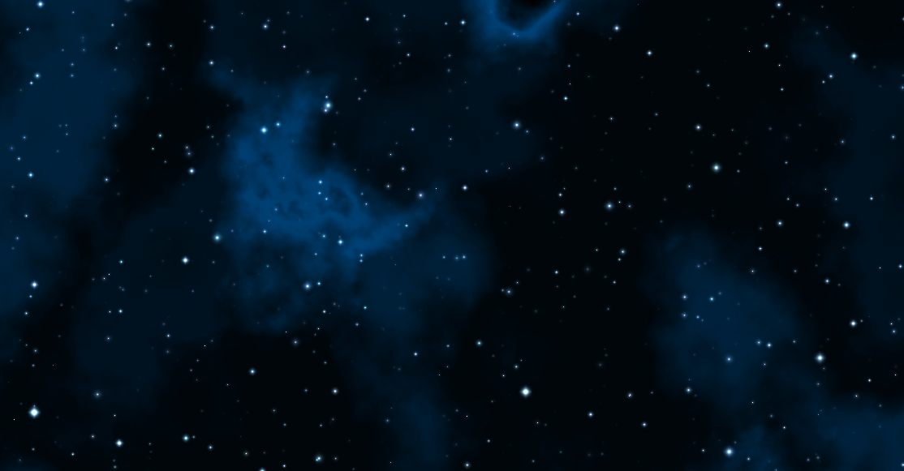
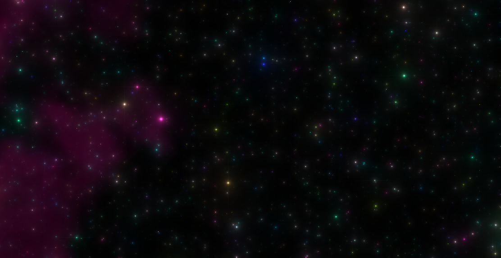
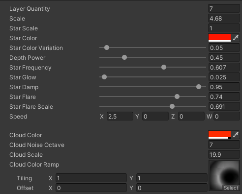

# Starfield Shader

This shader generate a starfield.
Import the **Shader** folder content to your project and simply use it on a Material. Works in 2D and 3D

## Example

## Config

| Layer Quantity | How many layer should be displayed |
|----------------------|--------------------------------------------------------|
| Scale | General scale of the starfield |
| Star Scale | Scale of stars |
| Star Color | Color of the stars | |
| Star Color Variation | 0 -> No color changes, 1 -> Random colors |
| Depth Power | Affect how far the layers are between each other |
| Star Frequency | % to display a star |
| Star Glow | How much star glow |
| Star Damp | How much the glow is blurry |
| Star Flare | Strength of flare (shininess) |
| Star Flare Scale | Scale of flares |
| Speed | Movement of the starfield (Vec2) |
| Cloud Color | Color of the clouds |
| Cloud Noise Octave | Octave in noise (higher means more details but slower) |
| Cloud Scale | Scale of the clouds |
| Cloud Color Ramp | 2D texture used for color selection |